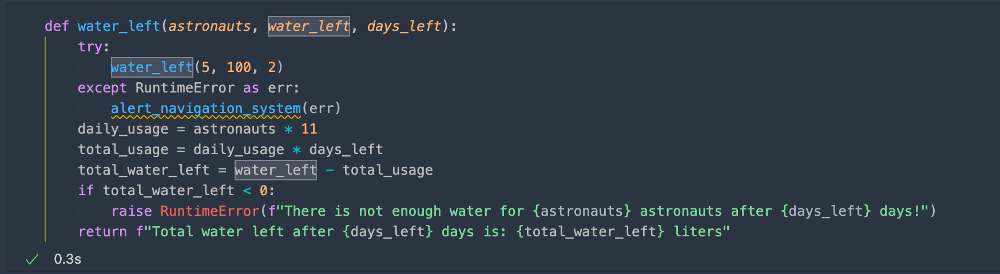

# Kata del módulo 10

## Uso de tracebacks para buscar errores

### Tracebacks

Intenta crear un archivo de Python y asígnale el nombre *open.py*, con el contenido siguiente:

```
def main():
    open("/path/to/mars.jpg")

if __name__ == '__main__':
    main()
```


## Controlando las excepciones
### Try y Except de los bloques

Vamos a crear un archivo de Python denominado config.py. El archivo tiene código que busca y lee el archivo de configuración del sistema de navegación:


A continuación, quitamos el archivo *config.txt* y creamos un directorio denominado *config.txt*. Intentaremos llamar al archivo *config.py* para ver un error nuevo.


Una manera poco útil de controlar este error sería detectando todas las excepciones para evitar un Traceback. Para comprenderlo mejor probaremos actualizando la función `main()`


Que, ejecutando en consola, nos aparece lo siguiente:


Vamos a corregir este fragmento de código para abordar todas estas frustraciones. Revertiremos la detección de `FileNotFoundError` y luego agregamos otro bloque `except` para detectar `PermissionError`:

```python
def main():
    try:
        configuration = open('config.txt')
    except FileNotFoundError:
        print("Couldn't find the config.txt file!")
    except IsADirectoryError:
        print("Found config.txt but it is a directory, couldn't read it")
```


Y al ejecutarlo, nos produce el siguiente resultado en consola:


Eliminamos el archivo config.txt para asegurarnos de que se alcanza el primer bloque `except` en su lugar:


Podemos agrupar las excepciones como si fuera una, usando paréntesis en la línea `except`, por ejemplo, si el sistema está bajo cargas pesadas y el sistema de archivos está demasiado ocupado, tiene sentido detectar `BlockingIOError` y `TimeOutError` juntos:


Si necesitas acceder al error asociado a la excepción, debes actualizar la línea `except` para incluir la palabra clave `as`. Esta técnica es práctica si una excepción es demasiado genérica y el mensaje de error puede ser útil:


Y en consola nos produce lo siguiente:


En este caso, `as err` significa que `err` se convierte en una variable con el objeto de excepción como valor; después, usa este valor para imprimir el mensaje de error asociado a la excepción. Otra razón para utilizar esta técnica es acceder directamente a los atributos del error. Por ejemplo, si detecta una excepción `OSError` más genérica, que es la excepción primaria de `FilenotFoundError` y `PermissionError`, podemos diferenciarla mediante el atributo `.errno`:


Y en consola nos produce lo siguiente:


## Generación de excepciones

Si conocemos una situación que podría provocar una condición de error al escribir código, resulta útil generar excepciones que permitan que otro código comprenda cuál es el problema.

En este ejemplo, tenemos que los astronautas limitan el uso de agua a 11 litros diarios; crearemos una función que, con base al número de astronautas, pueda calcular la cantidad de agua que quedará después de un día o más:


Probemos con 5 astronautas, 100 litros de agua y 2 días:


Esto no es muy útil ya que una carencia en los litros sería un error; para ello generaremos una excepción en la función `water_left()` para alertar de la condición del error:


Y al volverlo a ejecutar, tenemos:


Actualizamos la función `water_left()`para evitar el paso de tipos no admitidos



Y al pasar los argumentos, comprobamos el error `TypeError`:


Este error no es muy descriptivo en el contexto de la función, por lo que acutalizaremos la función para que use `TypeError` pero con un mensaje:


Y al volver a intentarlo, obtenemos:


**Fin del ejercicio**

---

- Github: [Rene-Bedolla](https://github.com/Rene-Bedolla)
